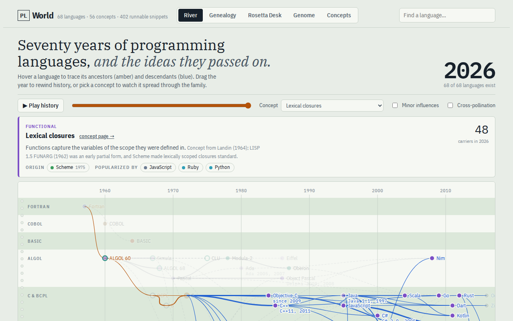
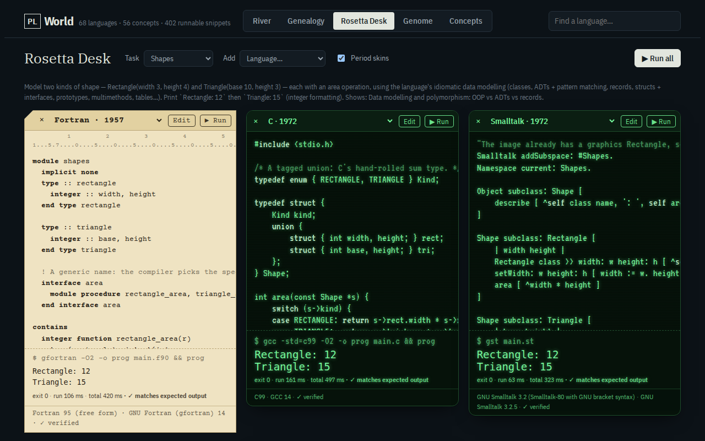
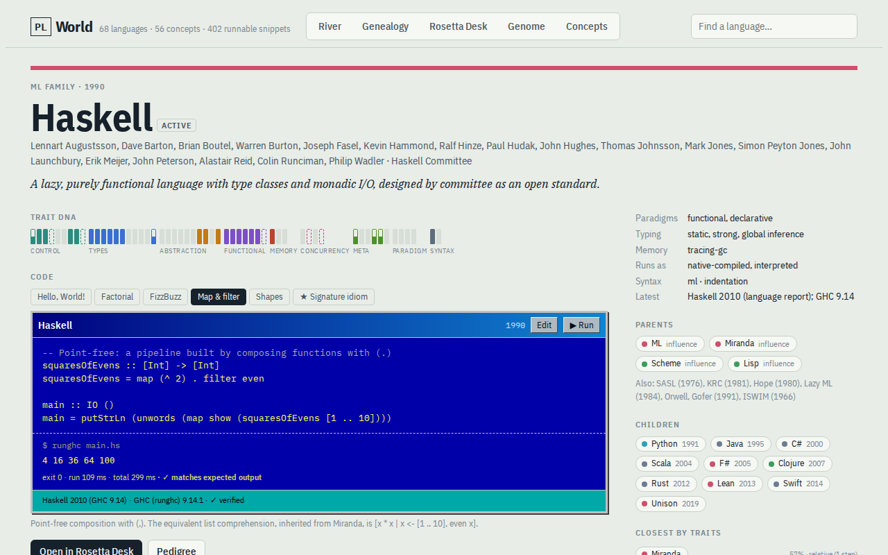
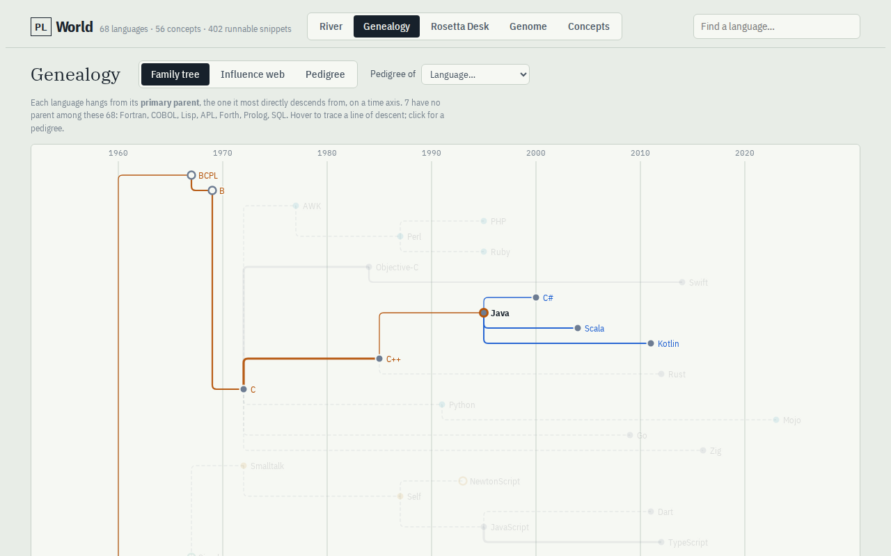
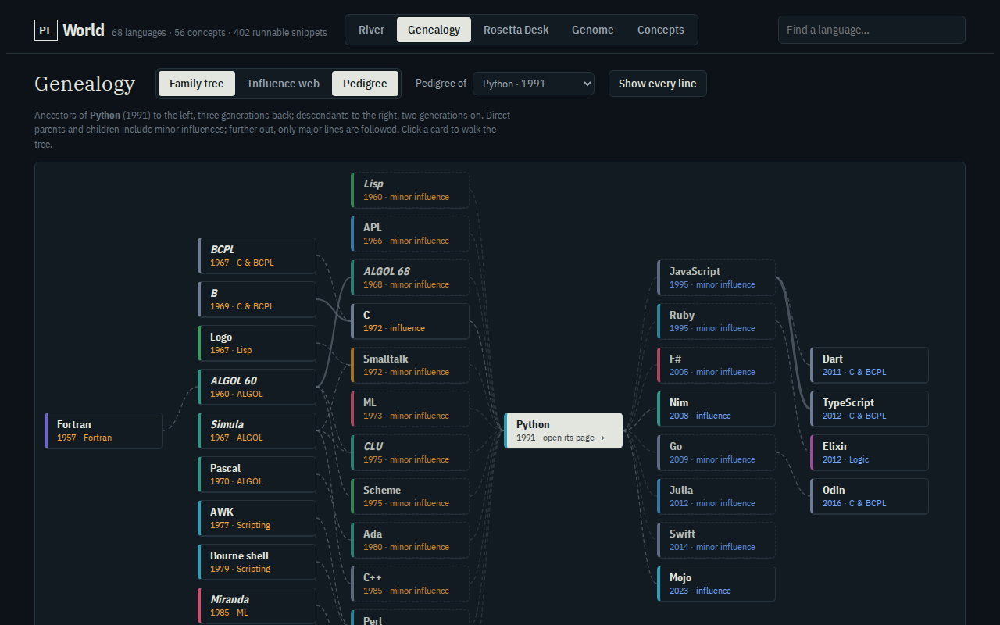
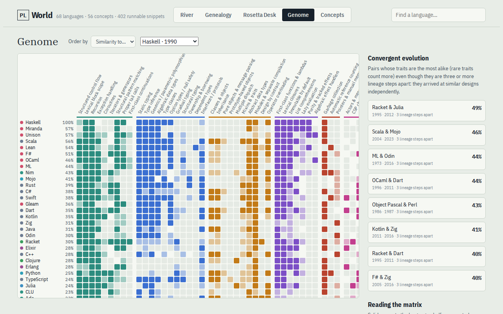
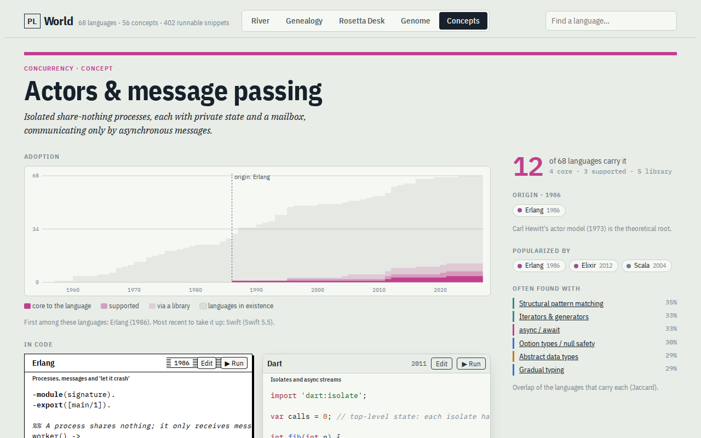

# PL World

An explorable museum of <!--languages-->68<!--/--> programming languages, from <!--span-->Fortran (1957) to Mojo
(2023)<!--/-->. It covers where each language came from (lineage), what it is made of (traits as genes), and how it
feels: the same <!--tasks-->6<!--/--> programs side by side, runnable on real toolchains in sandboxed containers (all
but AppleScript, which exists only on macOS). See [DESIGN.md](DESIGN.md) for the full design.



|                                                                                                                                                              |                                                                                                                                      |
| ------------------------------------------------------------------------------------------------------------------------------------------------------------ | ------------------------------------------------------------------------------------------------------------------------------------ |
|  |                 |
| **Rosetta Desk:** the same program in five eras, each window run on its real toolchain                                                                       | **Language page:** trait DNA, runnable snippets, lineage and history                                                                 |
|                                 |                           |
| **Genealogy:** the family tree by primary parent                                                                                                             | **Pedigree:** ancestors and descendants of one language, with the reasons                                                            |
|                       |  |
| **Genome:** <!--languages-->68<!--/--> languages × <!--concepts-->56<!--/--> concepts, and languages that converged independently                            | **Concept page:** where an idea came from, how it spread, and code built around it                                                   |

## Run it locally

Requires Deno 2.x and Docker.

```sh
deno task images          # build/pull the sandbox images (once; add ids to limit, --rebuild to refresh)
deno task dev             # runner on 127.0.0.1:8787 + web app on http://127.0.0.1:8000
```

`deno task dev` runs both processes. To run them separately, use `deno task runner` and `deno task web`. The web app
works without the runner. Its Run buttons then report that the runner is down.

## Pages

| Route                            | What it is                                                                                                                                                                                                                                                                        |
| -------------------------------- | --------------------------------------------------------------------------------------------------------------------------------------------------------------------------------------------------------------------------------------------------------------------------------- |
| `/`                              | **River**: languages on a time × family chart with lineage links. Hover to trace ancestry, scrub or play the years, pick a concept (`?gene=closures`) to watch it spread.                                                                                                         |
| `/tree`                          | **Genealogy**: the family tree (each language under its primary parent, on a time axis), the influence web (all <!--edges-->331<!--/--> lineage links, `?view=web`) and pedigrees (`?of=python`): three generations of ancestors, two of descendants, and the notes on each link. |
| `/lang/:id`                      | **Language page**: trait DNA, runnable snippets for each task, history, innovations, parents/children, closest languages by traits, milestones.                                                                                                                                   |
| `/compare?l=c,lisp,apl&t=shapes` | **Rosetta Desk**: up to six period-skinned code windows, editable (CodeMirror, Ctrl/⌘+Enter to run) and runnable, plus a trait diff.                                                                                                                                              |
| `/genome?sort=sim&to=rust`       | **Genome**: a <!--languages-->68<!--/--> × <!--concepts-->56<!--/--> language × concept matrix and convergent-evolution pairs.                                                                                                                                                    |
| `/concepts`                      | **Concepts**: all <!--concepts-->56<!--/--> concepts by category, each with its origin, carrier count and an adoption sparkline.                                                                                                                                                  |
| `/concept/:id`                   | **Concept page**: origin and popularizers, an adoption curve (carriers per year by level), the River with only carriers lit, every carrier with the year it took the idea up, snippets built around it and concepts it is often found with.                                       |

## Tasks

| Task                                             | Does                                                                                    |
| ------------------------------------------------ | --------------------------------------------------------------------------------------- |
| `deno task validate`                             | Check `data/` against the zod schema, lineage and snippet rules                         |
| `deno task build:db`                             | Build `dist/world.json` and `dist/pl.db` (SQLite + FTS5); `web` runs this on start      |
| `deno task docs [--check]`                       | Update the counts quoted in the Markdown docs (`build:db` runs it; CI checks it)        |
| `deno task screenshots [url] [names]`            | Re-capture the README screenshots and `og.png` from a running `deno task dev`           |
| `deno task build:layout`                         | Lay out the influence web with ELK into `dist/genealogy.json`; `web` runs this on start |
| `deno task runner`                               | The sandbox runner alone (`RUN_TIMEOUT_MS`, `PORT` env)                                 |
| `deno task web`                                  | The Fresh dev server alone                                                              |
| `deno task images [ids] [--rebuild] [--dry-run]` | Build `plw-*` images from `sandbox/<id>/Dockerfile`, pull the rest                      |
| `deno task verify [ids] [--task t] [--write]`    | Run every snippet in the sandbox and compare with its expected output                   |
| `deno task test`                                 | Runner unit and integration tests (needs Docker)                                        |
| `cd web && deno task build && deno task start`   | Production build served by `deno serve`                                                 |
| `deno task preview`                              | The production build in local `wrangler dev` (hosted mode)                              |
| `deno task deploy`                               | Build and deploy to Cloudflare Workers (needs `CLOUDFLARE_API_TOKEN`)                   |

## Layout

```
data/        source of truth: schema.ts (zod), languages/*.json, concepts.json, tasks.json
scripts/     validate.ts, build-db.ts, build-layout.ts (ELK layout for the influence web)
runner/      sandbox runner: sandbox.ts (docker plans, streaming), main.ts (HTTP/SSE), images.ts, verify.ts
sandbox/     Dockerfiles for toolchains without a usable public image (ALGOL 60, Simula, BCPL, B, CLU, …)
web/         Fresh 2 app: routes/ (SSR pages, /api/run proxy), islands/ (River, GenealogyChart, CodeWindow, …), lib/
design/      the static prototype
docs/        README screenshots
```

## Sandbox

Each run gets a fresh container with `--network none`, 1 GB memory, 2 CPUs, 512 pids, all capabilities dropped,
`no-new-privileges`, tmpfs work dirs and a 90 s wall clock. Output is capped at 64 KB. The runner listens on 127.0.0.1
only, answers only loopback `Host` names (against DNS rebinding) and only `application/json` posts (so other websites
open in your browser can't submit code). This is enough for local use. A public runner would also need gVisor
(`--runtime runsc`), a non-root user, a read-only root filesystem and rate limits (see DESIGN.md §4).

## Hosted copy (Cloudflare Workers)

The web app also runs on Cloudflare Workers, read-only: there is no runner behind it, so Run shows each snippet's
recorded output (verified on its real toolchain) and points to this repo for live runs. `wrangler.jsonc` and
`web/worker.js` wrap the Fresh build, serve static files from Workers Assets and cache rendered pages at the edge per
deployed version. Put `CLOUDFLARE_API_TOKEN` in `.env` (git-ignored) or the environment, then `deno task deploy`. To
back a hosted copy with a runner, set `RUNNER_URL` on the worker.

## Contributing

Language data lives in `data/languages/<id>.json`; `data/README.md` has the research conventions and `languages/c.json`
is the reference example. `deno task validate` checks the data. CI runs it on every push, and on pull requests it also
builds the sandbox image and runs the snippets of every language whose data or `sandbox/` recipe changed.

## License

[MIT](LICENSE)
